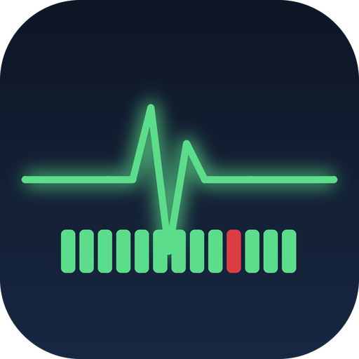

<p align="center">
  
</p>

<h1 align="center">InfraLab Mobile — Android</h1>

<p align="center">
  A native Android dashboard for your home-lab / self-hosted stack — Uptime Kuma, Grafana and a Homepage portal in one app.
</p>

<p align="center"><a href="#по-русски">Русская версия ниже ↓</a></p>

---

## What it does

InfraLab Mobile is a lightweight Jetpack Compose client that pulls everything together on your phone:

- **Monitors** — your **Uptime Kuma** status page rendered natively: nodes are collapsible groups with an aggregate heartbeat rollup; tap one to expand every check (ping / port / DNS / push…) with its own Kuma-style heartbeat bar, latency and 24 h uptime.
- **Metrics** — a list of your **Grafana** dashboards; open one and every panel is drawn **natively** from its PromQL (Compose-canvas time series, plus stat / gauge / bar-gauge / table) via the Grafana datasource proxy.
- **HomePage** — your [gethomepage](https://gethomepage.dev) portal in an in-app `WebView`.

Material 3 with **Dynamic Color (Material You)**, dark-first, read-only, with pull-to-refresh and a refresh timer.

## How it talks to your services

| Tab | Source | API |
|---|---|---|
| Monitors | Uptime Kuma | public status-page endpoints (`/api/status-page/<slug>`, `/api/status-page/heartbeat/<slug>`) |
| Metrics | Grafana | `/api/search`, `/api/dashboards/uid/<uid>`, and Prometheus via the datasource proxy (`/api/datasources/proxy/uid/<ds>/api/v1/query[_range]`) |
| HomePage | gethomepage | rendered in `WebView` |

No backend of its own — it just calls the services you already run, over your LAN/VPN or a reverse proxy.

> iOS version: **[InfraLabMobile](https://github.com/eva3si0n/InfraLabMobile)**.

## Requirements

| | Minimum |
|---|---|
| Android | 10 (API 29) |
| Build | JDK 17, Android SDK 35, Gradle 8.9 (wrapper included) |

## Build

```sh
# point to your Android SDK (or create local.properties with sdk.dir=...)
export ANDROID_HOME="$HOME/Library/Android/sdk"
./gradlew assembleDebug
# APK → app/build/outputs/apk/debug/app-debug.apk
adb install -r app/build/outputs/apk/debug/app-debug.apk
```

## Configuration

All endpoints are entered in the **Settings** tab on first launch — nothing is hardcoded:

| Field | Example |
|---|---|
| Kuma Base URL | `https://kuma.example.com` |
| Kuma Status-page slug | `default` |
| Kuma API Key | *(optional — leave empty for public status pages)* |
| Grafana Base URL | `https://grafana.example.com` |
| Grafana Datasource UID | `prometheus` |
| Grafana Service-Account Token | *(Viewer/Editor token)* |
| HomePage URL | `https://home.example.com` |

Tokens are stored with **EncryptedSharedPreferences**; plain settings in `SharedPreferences`.

## Screenshots

_Coming soon._

## License

[MIT](LICENSE) © Ivan Serditykh

---

## По-русски

**InfraLab Mobile (Android)** — нативный Android-дашборд для домашней лаборатории / self-hosted стека: **Uptime Kuma**, **Grafana** и портал **Homepage** в одном приложении.

- **Monitors** — статус-страница **Uptime Kuma** нативно: узлы — сворачиваемые группы со сводной heartbeat-шкалой; тап разворачивает все проверки (ping / port / DNS / push…), у каждой своя Kuma-style шкала, задержка и аптайм за 24 ч.
- **Metrics** — список дашбордов **Grafana**; открываешь — и все панели рисуются **нативно** по их PromQL (графики на Compose Canvas + stat / gauge / bar-gauge / table) через datasource-proxy.
- **HomePage** — твой портал [gethomepage](https://gethomepage.dev) во встроенном `WebView`.

Material 3 с **Dynamic Color (Material You)**, тёмная тема, только чтение, pull-to-refresh. Своего бэкенда нет — приложение обращается к сервисам, которые у тебя уже подняты (по LAN/VPN или через reverse-proxy).

iOS-версия: **[InfraLabMobile](https://github.com/eva3si0n/InfraLabMobile)**.

**Требования:** Android 10+ (API 29), JDK 17, Android SDK 35, Gradle 8.9 (wrapper в комплекте).

**Сборка:** `export ANDROID_HOME=…` → `./gradlew assembleDebug` → `adb install -r app/build/outputs/apk/debug/app-debug.apk`.

**Настройка:** все адреса вводятся во вкладке **Settings** при первом запуске — в коде ничего не зашито. Токены — в EncryptedSharedPreferences.

**Лицензия:** [MIT](LICENSE) © Ivan Serditykh
